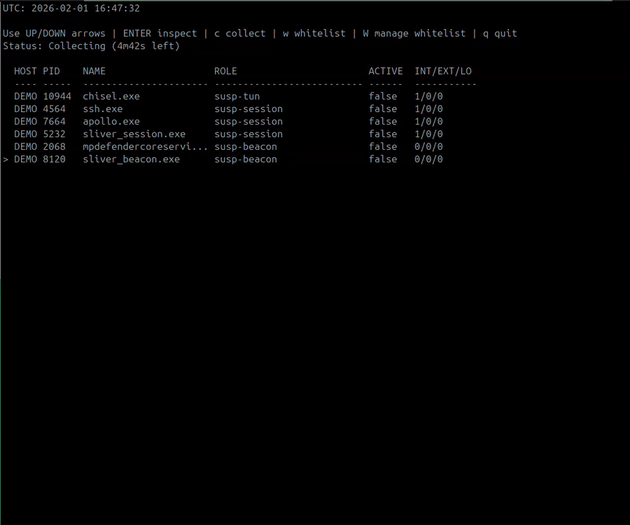

# ProxyWatch

ProxyWatch is a Windows userland network inspection tool that labels processes by role (tunnels, proxies, beacons) using TCP/UDP state and process context. It does not require kernel drivers, ETW, or packet capture.

ProxyWatch is built to be tuned for your environment. See [Role triggers and tuning](#role-triggers-and-tuning) for the exact files and example edits.

ProxyWatch (Agent) is a service that runs on remote endpoints and streams the results into a central ProxyWatch UI. Each build generates a unique TLS/mTLS trust bundle so only agents built from the same build can connect. Security comes first.

## Demo

ProxyWatch has a new UI for selecting and inspecting processes!, you can now terminate a processes directly from the inspector if it looks malicious. By default the UI shows only Suspicious Sessions, Beacons, and Tunnels, use the `-roles` flag to customize what you'd see within the UI. If you’re flooded with noise or hitting false positives, tune Proxywatch or whitelist trusted processes. In the demo, the beacon is detected based on the current thresholds; the collection was started 5 minutes ahead to catch it for this demo. During the demo you have also noticed a couple processes change roles from "susp-session" -> susp-tun", this is to demostrate the detection of socks proxies. ProxyWatch also supports BloodHound collection: set the name, output path, and duration, then import the JSON into BloodHound (SpecterOps/OpenGraph). With the included queries, you can map suspicious sessions, beacons, and tunnels down to exact host, user, and binary path.



---

## Quick start (local)

Interactive TUI:
```bash
proxywatch.exe
```

Keys:
- `UP/DOWN` to select
- `ENTER` to inspect
- `ESC` to return to dashboard
- `w` to whitelist the selected process
- `W` to open the whitelist manager (remove entries)
- `k` to kill the inspected process
- `q` to quit

---

## Multi-endpoint mode (ProxyWatch Agent)

1) Start ProxyWatch in ingest mode:
```bash
proxywatch.exe -listen 0.0.0.0:50051
```

2) Run the agent on each endpoint:
```bash
pwa.exe -server 10.0.0.5:50051
```

Optional agent flags:
- `-id` Host identifier (default: hostname)
- `-interval` Refresh interval (default `250ms`)
- `-incremental` Reuse classification for unchanged PIDs
- `--install` Install the ProxyWatch Agent Windows service
- `--uninstall` Uninstall the service
- `--start` Start the service
- `--stop` Stop the service
- `--service` Run under SCM (service mode only)

Notes:
- The dashboard shows a HOST column for each endpoint.
- Kill is available for remote hosts when the agent is connected.
- Use `-stale 30s` to drop endpoints that stop reporting.
- Transport is gRPC over TCP with JSON framing and automatic TLS/mTLS (generated at build time).
- Agent and UI must be built together so they share the same trust bundle.

---
## BloodHound collection

Collection is started from the TUI:
1) Press `c` to open the collection screen
2) Use `UP/DOWN` to select a field
3) Press `ENTER` to edit Output or Roles (type to change)
4) Use `LEFT/RIGHT` to change Duration
5) Select `Start/Stop` and press `ENTER` to start
4) Return to the dashboard while it runs
5) The JSON file is written automatically when the timer ends (or press `ENTER` again to stop early)

Works for both local mode and ingest mode (`-listen`).

I've come up with multiple Cypher queries for this project which are in [queries.md](queries.md).
<br>
<br>
Examples:

<br>
<br>

**Query Suspicious Proccess from users**

<br>
<br>

---

**Suspicious Connection internally showing the Information table**

<br>
<br>

---

**Full connection chain for interal connections**


---

## Features

- Behavior-based detection without signatures
- Role assignment for tunnels, proxies, and beacons
- Reverse-control and reverse-transport detection
- Listener and client mapping (TCP + UDP)
- Short-lived connection capture for fast scans
- TUI with per-process inspector and manual kill
- Multi-endpoint ingest with ProxyWatch Agent
- BloodHound collection output (JSON file)

---

## Roles

ProxyWatch assigns a best-fit role per process:

| Role                     | Meaning |
|--------------------------|---------|
| `susp-tun`               | Control channel with tunnel evidence (loopback transport or internal scan activity) |
| `susp-beacon`            | Periodic short-lived outbound beacons (for example ~60s callbacks) |
| `susp-session`           | Control channel without proxying evidence |
| `reverse-proxy`          | Control channel with proxied outbound activity |
| `reverse-transport`      | Control channel + active local forwarding (loopback) |
| `reverse-control`        | Persistent outbound control channel (idle) |
| `reverse-tunnel`         | Multiple outbound targets, no listener |
| `proxy-listener`         | Listener with clients + outbound forwarding |
| `listener-with-clients`  | Local clients without outbound |
| `listener-with-outbound` | Listener, no clients, outbound activity |
| `listener-only`          | Listener without traffic |
| `outbound-only`          | Outbound activity only |

---

## Role triggers and tuning

### Telemetry inputs (what the classifier looks at)

- TCP listeners (local ports) and whether they are loopback-only or wildcard bound
- Active inbound client sessions to those listeners
- Active outbound connections (internal vs external, distinct targets/ports)
- Connection age (short‑lived vs long‑lived) and short‑lived burst intervals
- Loopback transport activity (local↔local forwarding)
- Internal scanning/lateral movement hints (internal targets/ports)

### Role triggers (simplified)

- `reverse-control`: a persistent outbound control channel (oldest ESTABLISHED connection older than `ReverseControlMinDuration`) with only one active outbound target, not suppressed by `BenignControlPorts`.
- `reverse-transport`: `reverse-control` plus loopback transport activity.
- `reverse-proxy`: a control channel plus proxying activity to internal targets (lateral hints or internal target/port counts).
- `susp-session`: a persistent control channel without proxying evidence (and not `susp-tun`).
- `susp-tun`: a control channel plus loopback transport or internal scan activity (with reverse‑control/proxy evidence).
- `susp-beacon`: periodic short‑lived outbound bursts at or above `BeaconSleepThreshold` for `BeaconMinIntervals` within the scan windows; no listener and no long‑lived outbound.
- `proxy-listener`: listener + inbound clients + outbound.
- `listener-with-clients`: listener + inbound clients, no outbound.
- `listener-with-outbound`: listener + outbound, no inbound clients.
- `listener-only`: listener with no inbound or outbound activity.
- `reverse-tunnel`: no listener, outbound to multiple targets (`out >= 3`) with internal‑lateral evidence.
- `outbound-only`: outbound activity without listener (non‑suspicious default role).

### Where to edit (tuning files)

- [proxywatch/internal/shared/classifier_state.go](proxywatch/internal/shared/classifier_state.go)  
  Time windows, control thresholds, beacon thresholds, scoring baselines, benign control ports, and caps.
- [proxywatch/internal/shared/telemetry_types.go](proxywatch/internal/shared/telemetry_types.go)  
  Burst sampling windows and thresholds for short‑lived activity.
- [proxywatch/internal/shared/constants.go](proxywatch/internal/shared/constants.go)  
  Internal CIDRs and lateral movement ports.
- [proxywatch/cmd/proxywatch/main.go](proxywatch/cmd/proxywatch/main.go)  
  UI default role filter and the minimum score gate (`minScore`).

### Example edits

Make beacon detection stricter (longer interval, more repeats):
```go
// proxywatch/internal/shared/classifier_state.go
BeaconSleepThreshold = 120 * time.Second
BeaconMinIntervals = 3
```

Reduce false positives on common control ports:
```go
// proxywatch/internal/shared/classifier_state.go
ReverseControlMinDuration = 20 * time.Second
BenignControlPorts = map[int]bool{
	53: true, 80: true, 443: true, 8080: true,
	8443: true, 8000: true, 8001: true, 8008: true, 8888: true,
	9443: true, // add your own common benign ports here
}
```

Match your internal network ranges:
```go
// proxywatch/internal/shared/constants.go
InternalCIDRs = []string{
	"10.0.0.0/8",
	"172.16.0.0/12",
	"192.168.0.0/16",
	"100.64.0.0/10", // example: carrier-grade NAT
}
```

Raise or lower the UI score gate (what shows up as suspicious):
```go
// proxywatch/cmd/proxywatch/main.go
minScore := 25 // default is 15
```

After edits, rebuild to apply changes.

## Flags

- `-roles` Comma-separated list of roles to display (overrides the default UI filter)
- `-interval` Refresh interval (default `250ms`)
- `-incremental` Reuse classification for unchanged PIDs
- `-listen` Listen address for ProxyWatch Agent ingest (for example `0.0.0.0:50051`)
- `-stale` Drop remote hosts after this duration without updates (0 = keep)

---

## How it works (high level)

ProxyWatch uses:

- `GetExtendedTcpTable` (IPv4/IPv6) for TCP state and PID association
- `GetExtendedUdpTable` for UDP listeners
- Toolhelp process snapshots and Win32 APIs for process metadata
- Timestamped tracking of outbound connections for control-channel inference
- Heuristic scoring and role classification
- Burst sampling per refresh to capture short-lived connections

No packets are captured. No kernel components are required.

---

## Build

This repo is already a Go module (no `go mod init` needed).

Linux (copy/paste):
```bash
sudo apt-get update
sudo apt-get install -y git make golang-go

git clone https://github.com/In3x0rabl3/proxywatch.git
cd proxywatch
cd proxywatch
go mod download
make
```

Artifacts are placed in `dist/` by default.

## Windows service

Install and start the agent service (keeps running after the terminal closes):
```bash
pwa.exe --install --server 10.0.0.5:50051
pwa.exe --start
```

Stop and uninstall:
```bash
pwa.exe --stop
pwa.exe --uninstall
```

Notes:
- `--service` is intended for the Service Control Manager (SCM) only.
- Use the normal binary for debugging or ad‑hoc runs.

---

## Notes

- Terminating processes may require elevated privileges depending on target.
- Lateral ports are used as heuristic hints (SMB, RDP, WinRM, LDAP, MSSQL, SSH).
- The TUI defaults to showing only `susp-session`, `susp-beacon`, and `susp-tun`. Use `-roles` to override.
- Whitelisted processes are stored in the user config directory at `proxywatch/whitelist.json`.
